# Training a Small Text-to-Image Model From Scratch

This is the story of how I trained a small text-to-image model from scratch on MONET latents, then tried a simple Self-Flow-lite idea to make the training task richer.

I am using "from scratch" in a specific way:

- The image generator starts from random weights.
- I train that generator myself.
- I do not fine-tune Stable Diffusion, FLUX, or another finished image model.
- I do use frozen helpers: text embeddings, image latents, and a decoder that can turn latents back into pixels.

That last point matters. A modern text-to-image system is not one single block. It is a small pipeline of pieces. The piece I train here is the generator: the model that learns how to turn noise into image latents while listening to text.

The goal of this article is not to hide the rough parts. The goal is to show the whole process visually:

- what the data looks like
- what a latent is
- what the model actually sees
- what flow matching means
- what Self-Flow-lite changes
- what the samples look like as training improves
- where the model ends up
- what did and did not work

## The End Result First

The clearest successful result is a tiny overfit run. I trained the model on a small 512-example subset until it could reproduce that narrow world clearly.

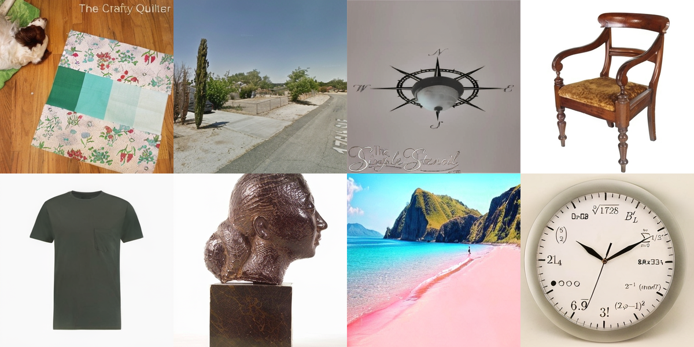

This is not a broad general-purpose image model. It is a proof that the training stack works:

- the data is shaped correctly
- the generator can learn
- sampling works
- decoding works
- the same prompts and same seed can be tracked over time

The broader run on more data becomes image-like, but it is still weak at following prompts:

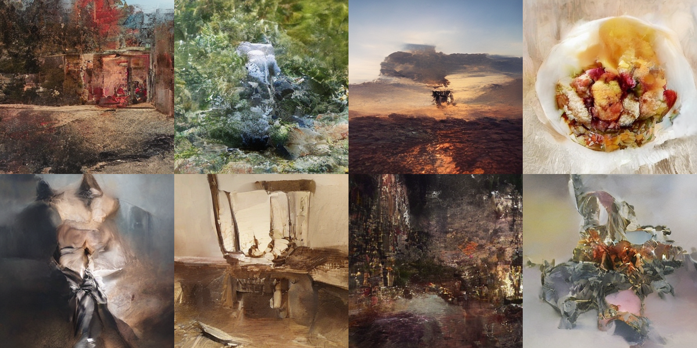

So the honest ending is:

- small overfit model: coherent
- broader model: image-like, but not reliably prompt-coherent
- Self-Flow-lite: useful idea and useful experiment, but not a magic fix by itself

That is still a good learning result because I can see exactly where the system starts to work and where it still fails.

## What I Am Training

The model does not directly paint pixels.

It trains in a compressed image space called latent space.

The simplest version of the pipeline is:

```text
caption text
  -> text vector

image
  -> image latent

noise + text vector
  -> trainable generator
  -> predicted direction through latent space
```

At the end, a frozen decoder turns the generated latent back into a visible image.

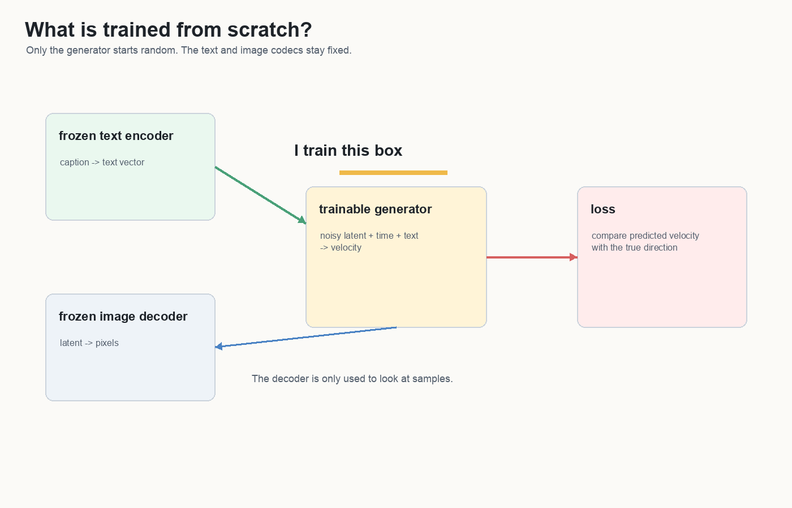

The important split is:

- frozen text encoder: turns a caption into numbers
- frozen image decoder: turns latents into pixels for viewing
- trainable generator: learns the image distribution

The generator is the part that starts random. At the beginning, it does not know what a dog, chair, beach, clock, or street looks like. It only learns because the training loop repeatedly shows it noisy latents and asks it to predict the right direction.

## What The Dataset Looks Like

Each training example has four useful parts:

1. an id
2. a caption
3. a text embedding
4. an image latent

Here is the shape of one row:

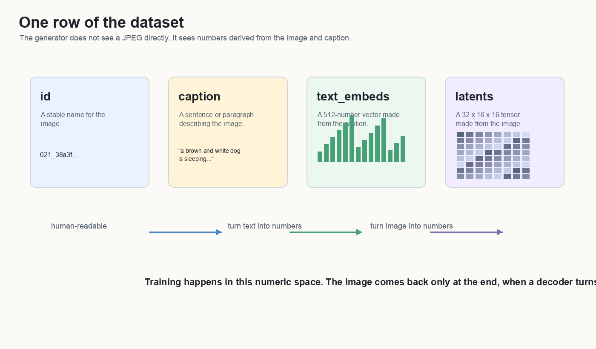

The caption is human-readable. The text embedding and image latent are not. They are just tensors.

For this project, a typical latent has this shape:

```text
32 x 16 x 16
```

That means:

- 32 latent channels
- 16 positions across
- 16 positions down

So one image becomes:

```text
32 * 16 * 16 = 8192 numbers
```

The text embedding has:

```text
512 numbers
```

Here are a few examples from the tiny subset I used for the overfit check. Each example has an image-like target, a caption, a latent tensor, and a text vector.

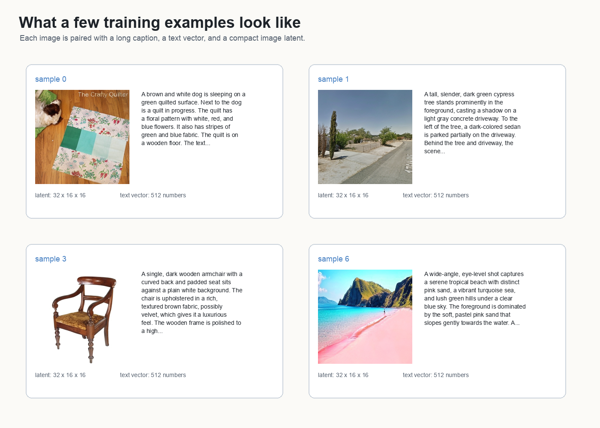

The captions are long because they describe visual details. For example, one caption describes a dog next to a quilt. Another describes a street scene with a cypress tree. Another describes a wooden chair. Another describes a bright beach.

The model never sees the caption as words like a person does. It sees the caption embedding: a vector of numbers.

The model never sees the image as a JPEG during training. It sees the image latent: a compact tensor.

## Why Train On Latents Instead Of Pixels?

Pixels are huge.

An RGB image at 512 by 512 has:

```text
512 * 512 * 3 = 786432 pixel values
```

The latent tensor I used has:

```text
32 * 16 * 16 = 8192 latent values
```

That is much smaller.

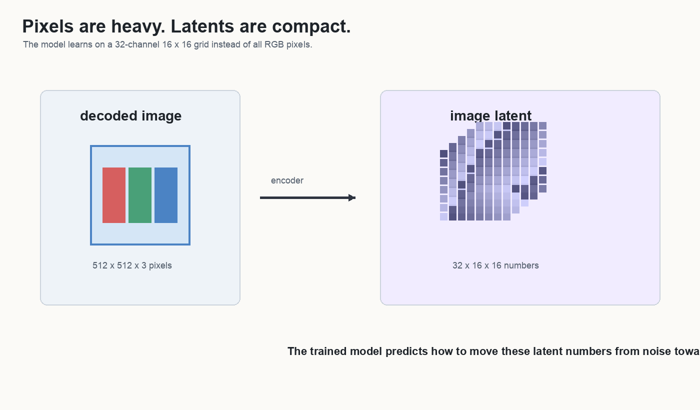

Training in latent space makes the problem more manageable. The model does not need to learn every pixel-level texture from scratch. It learns how to arrange a compressed representation that the decoder already knows how to turn into an image.

This is still hard. The latent has less information than the full image, but it still has structure:

- colors
- edges
- object layout
- texture hints
- scene composition

The generator learns to create that structure from noise.

## What "Text-To-Image" Means Here

Text-to-image sounds like:

```text
"a chair" -> image of a chair
```

But internally it is closer to:

```text
"a chair"
  -> text embedding
  -> conditioning signal
  -> guide a latent generator
  -> generated latent
  -> decoded pixels
```

The caption does not directly draw the image. It changes the generator's prediction at every step.

If the conditioning is strong, changing the prompt changes the image category.

If the conditioning is weak, changing the prompt may only change color or texture, or may do almost nothing.

That distinction became one of the main lessons in this project. A model can learn image-like texture before it learns strong prompt following.

## The Basic Training Problem

The training objective is flow matching.

I start with two points:

```text
x0 = clean image latent
x1 = random noise
```

Then I sample a timestep:

```text
t = a number between 0 and 1
```

Then I mix clean latent and noise:

```text
x_t = (1 - t) * x0 + t * x1
```

When `t` is close to 0, `x_t` is mostly image.

When `t` is close to 1, `x_t` is mostly noise.

The model gets:

```text
x_t, t, text_embedding
```

and learns to predict the direction between image and noise.

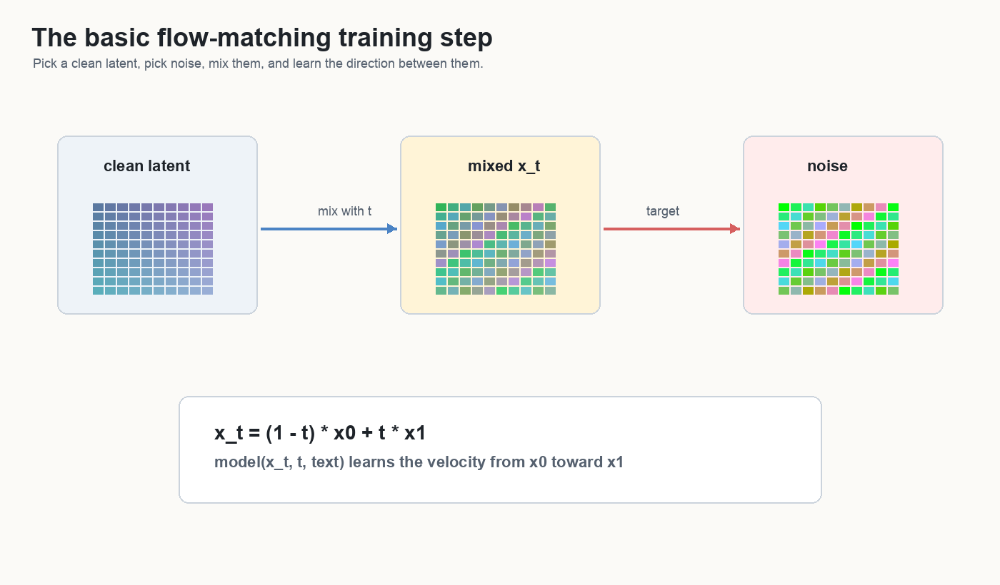

In simple words:

> I show the model a partly noisy latent and ask, "Which way should this point move?"

The answer is a velocity vector. A velocity vector is not an image. It is a direction through latent space.

## A Visual Toy Version Of Flow

This GIF is not the real tensor math. It is a visual analogy.

At one end, there is a clean image. At the other end, there is noise. During training, the model sees mixtures between the two.

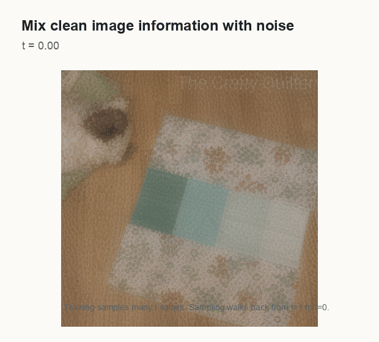

The model learns the path between image and noise.

Sampling walks that path backward.

## Sampling

After training, I do not start with an image. I start with random noise.

Then I repeatedly ask the model:

```text
Given this noisy latent, this timestep, and this text prompt,
which direction should I move?
```

After many small steps, the random latent becomes an image-like latent.

Then the decoder turns it into pixels.

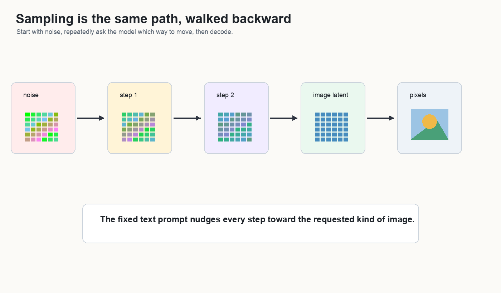

This is why text-to-image generation is iterative. The model does not output the final image in one shot. It gradually moves through latent space.

## The Model Shape

The generator is a transformer over latent tokens.

The latent has shape:

```text
32 x 16 x 16
```

I treat the 16 by 16 spatial grid as tokens:

```text
16 * 16 = 256 latent tokens
```

Each token contains 32 channels.

The transformer receives:

- latent tokens from `x_t`
- a timestep signal
- a text conditioning signal

It predicts:

- one velocity vector for each latent token

In plain language:

> For every patch in the latent image, predict how it should move.

The larger successful model I used for the later runs had about 113 million trainable parameters. That is small compared with production image generators, but large enough to show real behavior.

## Classifier-Free Guidance In Simple Terms

Classifier-free guidance is a sampling trick.

During training, I sometimes hide the text condition. That teaches the model two modes:

```text
with text:    "make this match the prompt"
without text: "make a plausible image"
```

At sampling time, I compare those two predictions and push harder in the direction of the prompt.

Simple version:

```text
guided_prediction =
    unconditioned_prediction
    + guidance_scale * (conditioned_prediction - unconditioned_prediction)
```

If guidance is too low, the prompt may be weak.

If guidance is too high, images can become oversaturated or distorted.

This happened in my samples. A guidance value around 1 looked calmer. Higher guidance sometimes made the image more dramatic, but not necessarily more correct.

## Why I Tried Self-Flow-Lite

Normal flow matching gives the whole image one timestep at a time.

For example:

```text
all patches use t = 0.63
```

That means every patch is corrupted by the same amount.

Self-Flow-style training asks a harder question:

```text
patch 1 uses t = 0.10
patch 2 uses t = 0.75
patch 3 uses t = 0.40
...
```

Some patches are clean-ish. Some are very noisy. Some are masked or heavily corrupted.

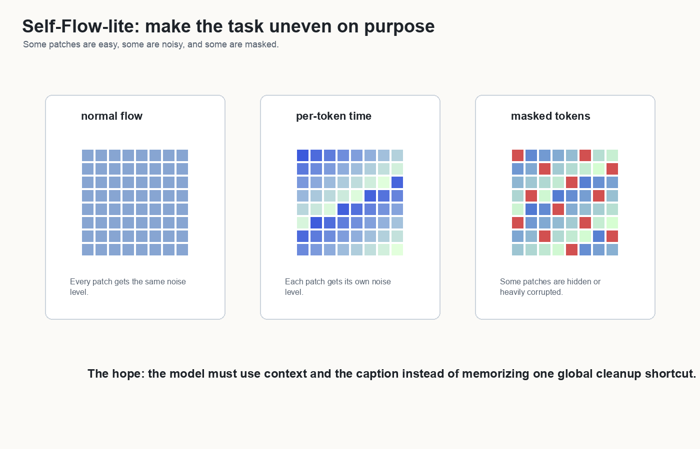

The hope is simple:

> If the task is uneven, the model cannot solve it with one global denoising shortcut. It has to use surrounding context and the text.

Here is the idea as a GIF:

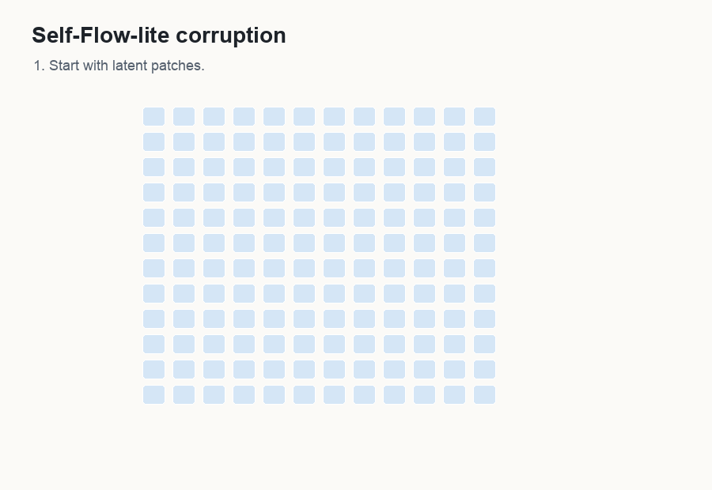

My Self-Flow-lite version used three additions:

1. per-token timesteps
2. token masking or heavy token corruption
3. an auxiliary reconstruction loss

## The Auxiliary Reconstruction Loss

The normal flow loss asks:

```text
Did the model predict the right velocity?
```

The auxiliary reconstruction loss asks:

```text
Does an internal layer contain enough information to reconstruct clean latent tokens?
```

This is not the full Self-Flow method. It is a smaller version that is easier to understand and easier to debug.

The point is to push the model to learn useful internal features, not only a surface-level cleanup direction.

## The Training Loop

Here is the loop in plain English:

1. Load a batch of image latents and text embeddings.
2. Sample random noise with the same shape as the image latents.
3. Sample timestep values.
4. Mix clean latents and noise.
5. Give the mixed latent, timestep, and text embedding to the generator.
6. Ask the generator to predict velocity.
7. Compare predicted velocity to the true velocity.
8. If Self-Flow-lite is enabled, also compute the reconstruction loss.
9. Update the generator weights.
10. Save checkpoints.
11. Sample fixed prompts to see visual progress.

The short pseudocode looks like this:

```python
for batch in data:
    x0 = batch["latents"]
    text = batch["text_embeds"]

    x1 = random_noise_like(x0)
    t = random_time()

    xt = (1 - t) * x0 + t * x1
    target_velocity = x1 - x0

    predicted_velocity = model(xt, t, text)
    loss = mse(predicted_velocity, target_velocity)

    if self_flow_lite:
        loss = loss + aux_reconstruction_loss

    loss.backward()
    optimizer.step()
```

That is the heart of the project.

Everything else is making sure the data, shapes, checkpoints, sampling, and visual monitoring are correct.

## One Training Step, Slowly

Here is the same training step again, but slower.

Imagine one batch contains 16 examples.

The batch has:

```text
latents:     16 x 32 x 16 x 16
text embeds: 16 x 512
```

The first dimension is the batch dimension. It just means I train on several examples at once.

For each example, I create random noise with the same latent shape:

```text
noise: 16 x 32 x 16 x 16
```

Then I sample one or more timesteps. In the plain baseline, every patch in one image uses the same timestep. In Self-Flow-lite, different patches can use different timesteps.

The mixed latent is still the same shape:

```text
x_t: 16 x 32 x 16 x 16
```

The target velocity is also the same shape:

```text
target: 16 x 32 x 16 x 16
```

That is important. The model is not predicting one label for the whole image. It predicts a velocity value for every latent value.

So the task is dense:

```text
input tensor  ->  output tensor of the same shape
```

The loss compares every predicted value to every target value.

In simple language:

> For every tiny part of the latent image, did the model predict the right direction?

## What The Generator Has To Learn

At the beginning, the generator is random.

That means its velocity predictions are basically guesses.

During training, it slowly learns several things at once:

1. What real image latents look like.
2. What random noise latents look like.
3. How to move between noise and image latents.
4. How the timestep changes the required move.
5. How text should influence the move.

Those are different skills.

This explains a common failure mode:

```text
The model learns image texture before it learns prompt control.
```

Texture is easier. The model can learn average colors, lighting, and shape statistics from many examples.

Prompt control is harder. The model must connect the text vector to specific visual decisions.

For example:

```text
"chair" should increase chair-like structure
"beach" should increase sand, water, sky, horizon
"clock" should increase circular face, numbers, hands
```

If the text conditioning is weak, the generator may still produce image-like things, but not the requested thing.

## Data Amounts I Used

I used several dataset sizes because each size answers a different question.

### Synthetic tensors

This stage answers:

```text
Does the code run at all?
```

No image quality question is answered here.

### Tiny real subset

This stage answers:

```text
Can the code load real MONET latents and text vectors?
```

The samples are not expected to be good.

### Around two thousand filtered examples

This stage answers:

```text
Does the model learn a real objective on a small real dataset?
```

This is where the baseline and Self-Flow-lite can be compared cheaply in terms of loss and early images.

### Around ten thousand filtered examples

This stage answers:

```text
Can the model learn a broader image distribution?
```

This is where samples become more image-like, but prompt following is still difficult.

### A 512-example overfit subset

This stage answers:

```text
Can the model memorize a small visual world?
```

This was the cleanest success.

The reason I like this ladder is that each step has a clear purpose. I do not need to guess what failure means.

If synthetic tensors fail, the code is broken.

If tiny real data fails, the data path is broken.

If the 512-example overfit fails, the architecture, objective, or sampler is probably wrong.

If the 512-example overfit works but the broad run is weak, the core system works and the remaining issue is generalization or conditioning.

That is exactly what happened.

## How I Read The Visuals

When I look at a generated grid, I ask different questions at different stages.

Early in training, I ask:

```text
Is it pure noise?
Does it have color structure?
Does it have any large shapes?
```

In the middle, I ask:

```text
Are there scene-like layouts?
Are objects starting to appear?
Are images collapsing into the same texture?
```

Later, I ask:

```text
Does each prompt produce a different kind of image?
Does the same prompt improve over checkpoints?
Is the model oversaturated?
Is the image sharper but less prompt-faithful?
```

For this project, the answer was:

- early samples: mostly texture
- middle samples: image-like but vague
- 512 overfit samples: coherent
- broad samples: image-like but weakly controlled

That is why the final article is not just a celebration of the best grid. The failure modes are part of the explanation.

## What Each Visual Asset Is Doing

I made the visuals for different reasons.

The dataset card visual answers:

```text
What is in one training example?
```

The latent-shape visual answers:

```text
Why train in latent space?
```

The flow visual answers:

```text
What does the model learn to predict?
```

The sampling visual answers:

```text
How does noise become an image?
```

The Self-Flow-lite visual answers:

```text
What changes compared with normal flow matching?
```

The progress GIFs answer:

```text
What does improvement look like?
```

This matters because text-to-image training can become abstract very quickly. The more I can tie each concept to a picture, the easier the whole system is to understand.

## Why Smoke Tests Matter

Before training on real data, I used synthetic tensors.

The synthetic test does not prove image quality. It proves the code can run:

- the dataloader returns tensors
- the model accepts the shapes
- the loss computes
- the optimizer updates weights
- checkpoints save
- validation runs

This sounds boring, but it prevents a painful failure later. If the tiny synthetic test fails, the real training run will fail too.

After synthetic tensors, I used a tiny real MONET subset. That checks the real latent shape:

```text
latents:     32 x 16 x 16
text vector: 512
```

This is where I confirmed the model was seeing the expected data.

## The First Time Images Start To Look Like Images

There is a moment in training where samples stop looking like random patterns and start looking like weak images.

That moment is easy to miss if I only look at loss.

In the broader progress GIF, the early frames are mostly soft texture. Later frames start to show stronger composition:

- a horizon-like band
- a central object-like shape
- darker foreground regions
- bright sky-like areas
- repeated visual motifs

The model is learning the image prior.

But an image prior is not the same as text control.

An image prior means:

```text
I know what images tend to look like.
```

Text control means:

```text
I know how this caption should change this image.
```

The broader model got partway through the first sentence and only weakly into the second.

## Why The 512-Example Overfit Was So Important

The overfit run is sometimes misunderstood.

The point is not to build a useful generator from 512 examples.

The point is to remove ambiguity.

If the broad model is bad, many things could be wrong:

- the dataset is too broad
- the model is too small
- the captions are too noisy
- the text conditioning is weak
- the sampler is wrong
- the decoder is wrong
- the training objective is wrong

An overfit run narrows the list.

When the model successfully overfits 512 examples, I know:

- the tensors line up
- gradients are flowing
- the model has enough capacity for a small world
- the sampler can produce clear images
- the decoder can show those images

So the broad failure becomes more specific:

```text
The model can learn, but the broad task is still too hard for this setup.
```

That is a much better diagnosis.

## A Simple Mental Model For Self-Flow-Lite

I think about Self-Flow-lite like a puzzle with missing pieces.

Normal flow matching says:

```text
Here is the whole image at one noise level.
Predict the direction.
```

Self-Flow-lite says:

```text
Here is one image where every patch may be at a different noise level.
Some patches are almost clean.
Some patches are very noisy.
Some patches are hidden.
Predict the direction anyway.
Also preserve useful internal information.
```

This changes the pressure on the model.

With normal flow, the model can sometimes solve the task by learning a broad cleanup rule for the whole image.

With Self-Flow-lite, the model has to look around:

```text
This patch is noisy.
The patch next to it is cleaner.
The caption says chair.
The surrounding shape has chair-like edges.
So this patch should become part of a chair.
```

That is the intuition.

The challenge is that a harder task can also make training harder. If the base model is not already learning good text control, Self-Flow-lite may improve the loss without producing the kind of visual jump I want.

That is what I saw.

## Why The Broad Model Was Still Useful

The broad model did not become a strong text-to-image model, but it was not a wasted result.

It taught me where the next bottleneck is.

The samples are not random. They have:

- lighting
- depth
- object-like regions
- material texture
- landscape-like structure
- interior-like structure

So the model learned something real.

The missing piece is reliable prompt binding.

Prompt binding means:

```text
The word "chair" binds to chair-shaped pixels.
The word "cat" binds to cat-shaped pixels.
The word "road" binds to road-like layout.
```

The broad model does this weakly at best.

That suggests the next experiment should make prompt binding easier.

For example, instead of using a very broad set of captions, I would start with a narrower set of object categories and short prompts.

## How I Would Make The Next Dataset Easier

The next dataset would not just be "more data."

It would be cleaner data.

I would build a subset like this:

```text
category: chair
prompt:   a wooden chair

category: dog
prompt:   a dog on a blanket

category: beach
prompt:   a beach with blue water

category: clock
prompt:   a round wall clock
```

This would make the learning signal simpler.

The model would not need to parse long captions with many details. It would first learn strong category control.

After that works, I would add longer captions back in.

This is like teaching:

1. first learn nouns
2. then learn attributes
3. then learn full scenes

For this project, I jumped into rich captions early. That made the experiment more realistic, but also harder.

## What I Mean By "Coherent"

I use "coherent" in a practical way.

An image is coherent if:

- it is not random noise
- it has a stable subject or scene
- its parts roughly belong together
- it has plausible color and lighting
- a person can name what it is

The overfit final grid is coherent.

The broad grid is partially coherent. Some panels have scene structure, but the prompt relationship is weak.

I use "prompt-coherent" more strictly.

An image is prompt-coherent if:

- the requested object appears
- the requested scene appears
- changing the prompt changes the content in the expected way
- the image is not only aesthetically plausible, but semantically aligned

By that stricter standard, the broad model is not solved.

## Why The Decoder Is Not The Main Story

The decoder matters because it is how I see the generated latent.

But the decoder is not the model I trained.

The generator's job is:

```text
noise + text -> image latent
```

The decoder's job is:

```text
image latent -> pixels
```

If the generator produces a bad latent, the decoder cannot rescue it.

If the generator produces a good latent, the decoder can reveal it.

That is why I focus on the generator training while still checking decoded samples often.

## A Practical Checklist For Future Runs

Before trusting a run, I would check:

```text
1. Do real latents decode into recognizable images?
2. Can the model overfit a tiny subset?
3. Does validation loss decrease at first?
4. Do fixed-prompt samples improve over checkpoints?
5. Does changing the prompt change the image?
6. Does stronger guidance help or only distort?
7. Does Self-Flow-lite improve images, not just loss?
8. Does the model collapse to one repeated texture?
9. Are broad samples image-like?
10. Are broad samples prompt-coherent?
```

This checklist keeps me honest.

The answer does not have to be yes for every item. But the pattern of yes and no tells me what to fix next.

## First Real Visuals

The first generated images were not good. That is expected.

Here is a tiny baseline sample:

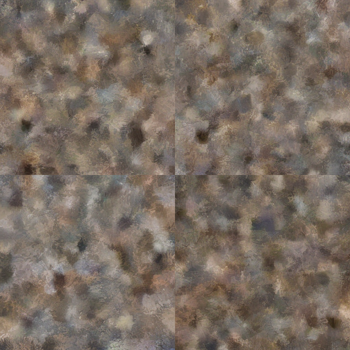

Here is a tiny Self-Flow-lite sample:

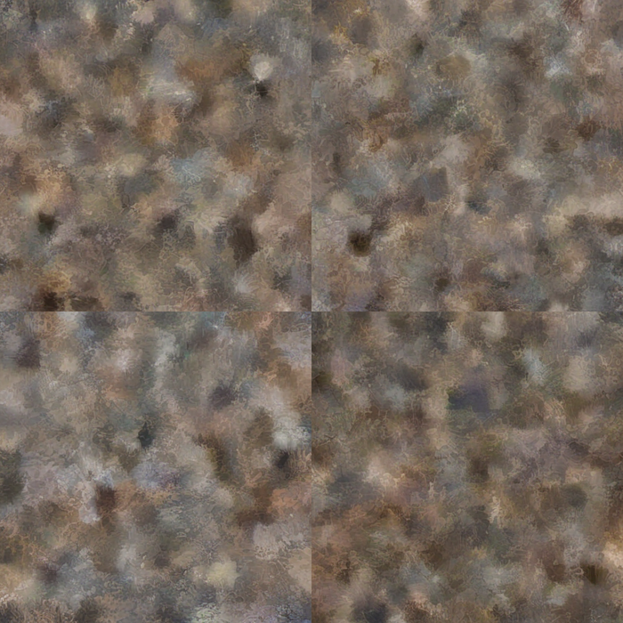

These are not meaningful image generators yet. They are workflow checks.

The useful lesson is:

> A model can have a working training loop and still generate texture-like outputs early on.

## Small Matched Baseline vs Self-Flow-Lite

I then compared a small baseline and a small Self-Flow-lite run on the same filtered subset.

Baseline:

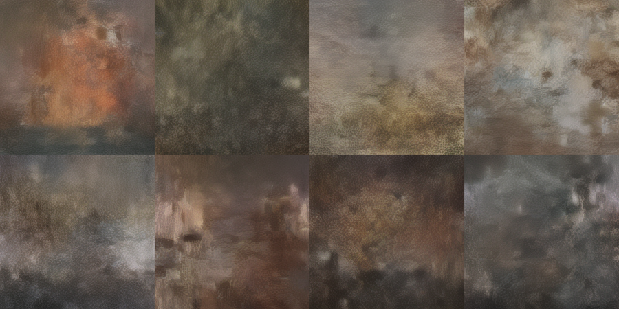

Self-Flow-lite:

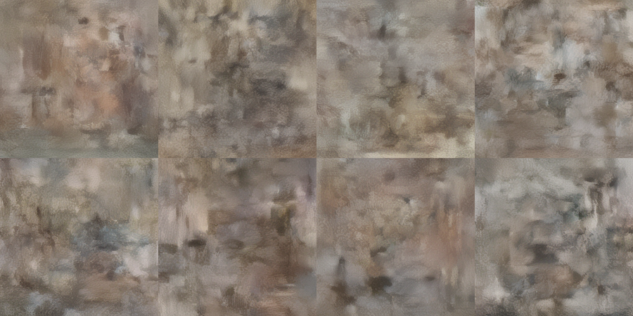

At this stage, Self-Flow-lite lowered validation velocity loss compared with the matched baseline. But the images were still not object-recognizable.

That is an important result:

> A lower loss is not the same as a good image.

Loss told me the model was learning the numeric objective. The sample grids told me it had not yet learned strong visual structure.

## The Broader Run

After the small checks, I trained a stronger model on a larger filtered subset.

The samples became more image-like over time, but they still struggled with prompt following.

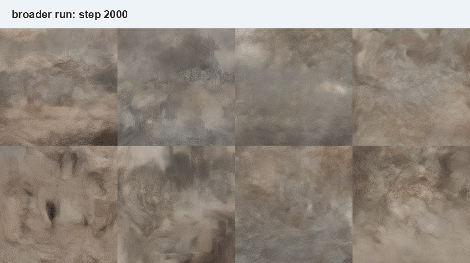

This is where the project became more interesting.

The model was no longer pure noise. It learned:

- color fields
- scene-like layouts
- object-ish shapes
- lighting
- texture

But prompt following remained weak. A prompt like "a cat sitting on grass" did not reliably become a cat. A prompt like "a bowl of fruit" did not reliably become fruit.

That means the model learned some image distribution, but the text conditioning was not strong enough.

## Watching Loss Is Not Enough

Here is a validation-loss curve from one long run.

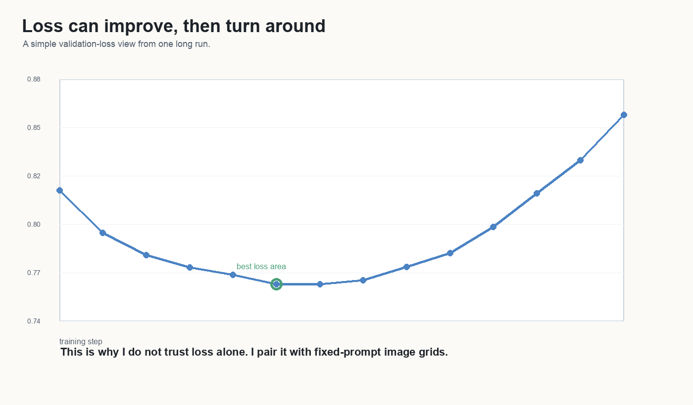

The loss improves at first, then starts getting worse.

This is why I do not only look at loss. I also keep fixed visual samples.

The fixed visual sample rule is:

```text
same prompts
same initial noise
same sampler settings
different checkpoints
```

If I change the prompt or seed every time, I cannot tell whether the model improved or whether I just got a lucky sample.

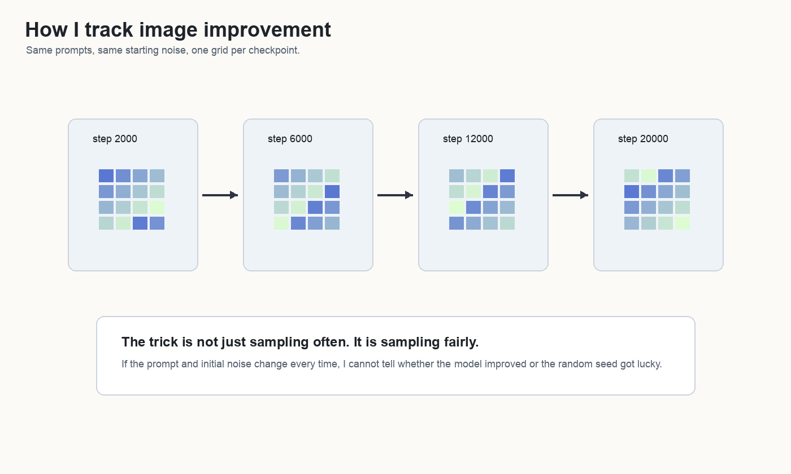

## The Tiny Overfit Test

The most useful test was the 512-sample overfit run.

The question was:

> Can this model memorize a small visual world?

If the answer is no, then the architecture, objective, or sampling path is broken.

If the answer is yes, then the core system works and the next problem is generalization.

Here is the overfit progress:

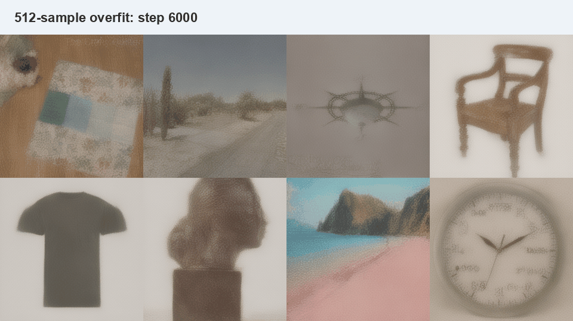

The final grid is clear:


This run taught me the most important debugging lesson:

> The model can produce coherent images when the problem is small enough.

That means the remaining broad-run weakness is not just "the sampler is broken" or "the decoder is broken." It is mostly about data scale, conditioning strength, and generalization.

## What The Final Tiny Model Learned

The tiny model learned a narrow set of examples:

- a dog next to a quilt
- a street with a tall tree
- a compass-style ceiling light graphic
- a wooden chair
- a plain shirt
- a bust sculpture
- a bright beach
- a wall clock

It did not learn the full world.

It learned this tiny world very well.

That is exactly what an overfit test should show.

## What The Broader Model Learned

The broader model learned a weaker but more general image prior.

Here is the best broad visual grid I kept:


It has structure:

- landscapes
- objects
- interiors
- lighting
- texture

But it is not reliably faithful to the prompts.

This is the difference between:

```text
image-like
```

and:

```text
prompt-coherent
```

The model reached the first stage. It did not fully reach the second stage.

## Why Prompt Following Was Hard

I think prompt following was hard for several reasons.

First, the dataset is broad. A broad dataset contains many visual styles, objects, crops, compositions, and caption styles. A small model can spend a lot of capacity learning "what images look like" before it learns exact prompt control.

Second, the captions are long. Long captions contain many details. The model may not know which detail matters most.

Third, the text embedding is a compressed vector. The model has to learn how that vector maps to visual structure.

Fourth, flow loss does not directly ask:

```text
Did the generated image match the prompt?
```

It asks:

```text
Did the velocity prediction match the target velocity?
```

Those are related, but they are not identical.

## What Self-Flow-Lite Helped With

Self-Flow-lite made the task richer.

It improved some losses in small matched comparisons.

It also made the model learn from uneven corruption rather than one uniform noise level.

That is useful.

But it did not automatically solve prompt following.

My practical read is:

- Self-Flow-lite is a reasonable training idea.
- It can improve the numeric objective.
- It does not replace the need for good data, strong conditioning, and enough model capacity.

## What I Would Change Next

If I continued this project, I would not simply train the same broad run longer.

I would change the problem.

The next experiments I would try:

1. Train on a narrower subset first.
2. Group examples by simple object categories.
3. Use shorter, cleaner prompts for early training.
4. Compare generic captions vs object-focused captions.
5. Run a matched baseline and Self-Flow-lite comparison on the same curated subset.
6. Keep the same fixed-prompt monitoring grid for every checkpoint.

The goal would be to make prompt following easier to learn before scaling back to a broad dataset.

## The Monitoring Recipe

This is the visual monitoring recipe I would keep for every future run.

### 1. Fixed prompts

Use the same prompts every time:

```text
a red car on a road
a cat sitting on grass
a mountain landscape at sunset
a bowl of fruit on a table
a portrait of a woman wearing sunglasses
an old wooden chair in a sunlit room
a city street after rain at night
a small robot holding a flower
```

### 2. Fixed initial noise

Use the same starting noise for each checkpoint.

This isolates model progress.

### 3. Same sampler settings

Do not change the number of sampling steps or guidance scale when comparing checkpoints.

### 4. Save a grid for each checkpoint

Use one image grid per checkpoint.

### 5. Make a GIF

Turn the checkpoint grids into a GIF.

The GIF makes progress easier to see than a folder of static images.

### 6. Compare with validation loss

Use loss curves and samples together.

Loss answers:

```text
Is the model improving on the objective?
```

Samples answer:

```text
Do the images look better?
```

Both matter.

## The Main Lessons

### Lesson 1: Shape bugs are expensive mentally

Before thinking about research ideas, I had to make sure the tensors were exactly what I thought they were.

The key shapes were:

```text
latents:     batch x 32 x 16 x 16
text embeds: batch x 512
```

If those are wrong, everything after that is noise.

### Lesson 2: A working loss is not a working image model

The model can lower loss before it generates recognizable images.

This is why I sampled often.

### Lesson 3: Overfit tests are powerful

The 512-sample overfit run answered a clean question:

```text
Can this model learn this small world?
```

The answer was yes.

That gave me confidence in the core training setup.

### Lesson 4: Prompt following is its own problem

Image-likeness and prompt-following are not the same.

A model can learn textures, lighting, and composition while still ignoring the exact object in the prompt.

### Lesson 5: Self-Flow-lite is an ablation, not a miracle

The Self-Flow-lite idea is interesting because it changes the learning task:

- different patch noise levels
- masked tokens
- reconstruction pressure

But it still needs a strong base setup.

## The Whole Process In One Picture

Here is the simplest mental model:

```text
dataset row
  -> caption vector + image latent
  -> mix image latent with noise
  -> generator predicts velocity
  -> loss updates generator
  -> sampling starts from noise
  -> generated latent
  -> decoder makes image
```

If Self-Flow-lite is enabled:

```text
same path
  + different timesteps per latent patch
  + masked or heavily corrupted patches
  + auxiliary reconstruction loss
```

## What I End With

I end with two honest artifacts.

First, a coherent tiny overfit model:


Second, a broader partial model that is image-like but not fully prompt-coherent:

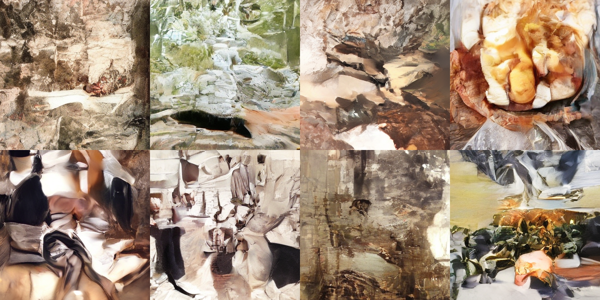

That is a good place to stop and write, because the article has a real story:

1. I built the data path.
2. I trained a generator from random weights.
3. I tested baseline flow matching.
4. I added Self-Flow-lite.
5. I tracked samples over time.
6. I proved the model can learn a small world.
7. I found the next bottleneck: broad prompt following.

The most important thing I learned is that text-to-image training is not one trick. It is a chain.

Every link matters:

- data
- captions
- latents
- conditioning
- objective
- architecture
- sampler
- decoder
- monitoring

When the chain works on a tiny world, the images become clear.

When the chain is scaled to a broader world, the hard part becomes control: getting the model to follow the prompt, not just make something image-like.

That is the next frontier for this project.

## Glossary

### Caption

The text description paired with an image.

Example:

```text
A brown and white dog is sleeping next to a quilt.
```

### Text embedding

A list of numbers that represents the caption.

The model does not read words directly. It reads this vector.

### Latent

A compressed numeric representation of an image.

Instead of training on pixels, I train on latents.

### Decoder

A frozen model that turns latents back into visible pixels.

### Generator

The trainable model in this project.

It learns how to move from noise toward image latents.

### Flow matching

The objective where the model learns a direction field between clean data and noise.

### Timestep

A number that tells the model how noisy the current latent is.

### Velocity

The direction the model predicts.

In this project, velocity tells the sampler how to move through latent space.

### Sampling

The process of starting from noise and repeatedly moving toward an image latent.

### Classifier-free guidance

A trick that compares conditional and unconditional model predictions, then pushes the sample harder toward the prompt.

### Self-Flow-lite

My simplified version of Self-Flow-style training:

- per-token timesteps
- masked or heavily corrupted tokens
- auxiliary reconstruction loss

### Overfit test

A small training run where I deliberately let the model memorize a tiny subset.

This is useful for debugging because a model that cannot overfit a tiny subset probably has a deeper issue.

